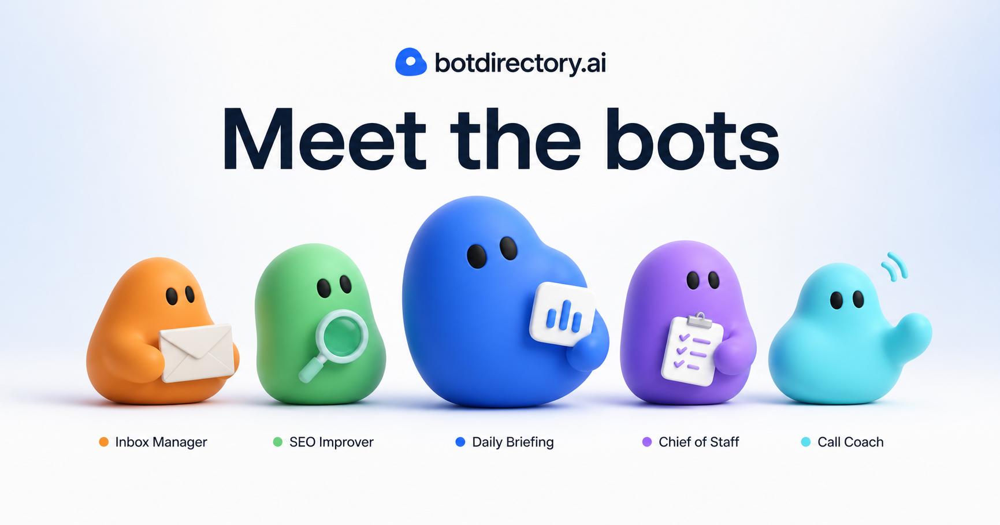

# botdirectory.ai

A community-maintained directory of ready-to-use agent prompts for [Grok Bot](https://x.ai/bot),
[Rakazo](https://rakazo.com), and any agent you already use. Copy a prompt,
paste it into your agent, and it sets itself up as a scheduled bot — email
triage, daily briefings, SEO fixes, churn warnings, and more.

**Live site: [botdirectory.ai](https://botdirectory.ai)**



## Add your bot in 2 minutes

A bot is one markdown file in [`bots/`](bots/):

```markdown
---
name: SEO Improver
category: Marketing
added_at: "2026-08-18T12:00:00.000Z"
contributor: rakazo
integrations: [GitHub, DataForSEO, Search Console]
integration_urls: { DataForSEO: https://dataforseo.com }
---

Set up a new bot for me. Walk me through connecting GitHub, DataForSEO and
Google Search Console, then schedule it every 2 weeks: find pages losing
impressions or sitting on page two, rewrite titles and metadata, fix internal
links, and open a PR I review before merge.
```

1. Fork this repo and add `bots/<slug>.md` (slug = name, lowercased,
   non-alphanumerics → `-`).
2. Open a pull request. CI validates the file; once merged it's live.

Or skip git entirely: **tag [@botdirectoryai](https://x.com/botdirectoryai) on X**
with your prompt and the mention bot opens the PR for you.

Full contract, category list, and quality bar: [CONTRIBUTING.md](CONTRIBUTING.md).

## Public API

Full contract (readable without JavaScript): [botdirectory.ai/api](https://botdirectory.ai/api/).

**Read (keyless).** `GET https://api.botdirectory.ai/api/bots` returns listings as
paginated JSON. It accepts `q`, `category`, `integration`, `page`, `limit`
(maximum 100), and `sort` (`newest` or `name`). For append-safe synchronization,
begin with `cursor=start` and reuse the returned `sync.nextCursor`:

```text
https://api.botdirectory.ai/api/bots?q=slack&category=Ops&page=1&limit=25&sort=newest
https://api.botdirectory.ai/api/bots?cursor=start&limit=100
```

For mirroring the whole directory in one request, use the canonical raw feed
at `https://botdirectory.ai/api/bots.json`.

**Write (API key).** `POST https://api.botdirectory.ai/api/bots` validates a bot
payload against the contribution contract and opens a GitHub PR adding
`bots/<slug>.md` (does not push to `main`). `POST/GET /api/feedback` stores and
lists listing feedback. Send `Authorization: Bearer <API_WRITE_KEY>` or
`X-Api-Key: <API_WRITE_KEY>`. Secrets and deploy: [`workers/api/README.md`](workers/api/README.md).

## Local dev

Astro static site, TypeScript, pnpm, no UI framework.

```sh
pnpm install
pnpm dev        # http://localhost:4321
pnpm build      # static build in dist/
pnpm validate   # check every file in bots/
pnpm test:api   # write-API validation helpers
pnpm check      # astro check (types)
```

- `bots/` — the product: one markdown file per bot
- `data/` — integrations (dot color + auth), sponsors, promos, sponsor facts
- `src/config.ts` — every branded string, URL, and knob
- `workers/api` — Cloudflare Worker for `api.botdirectory.ai` (list + write)

## Sponsoring

Sponsor slots (the rail next to the list) are monthly and capped. See the
[sponsor section](https://botdirectory.ai/#sponsor) on the site.

## License

[MIT](LICENSE) © 2026 Inbox Zero Inc.
